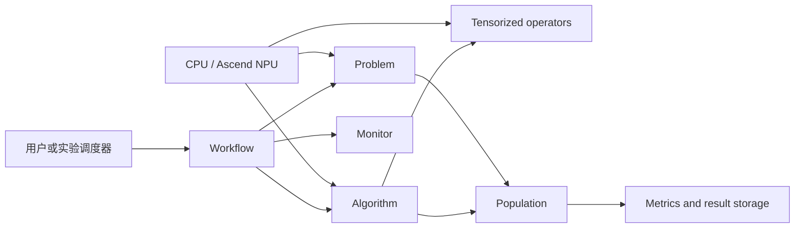

# 平台定位与边界

## 解决的问题

AscendMOEA 面向需要同时处理多个冲突目标的演化优化任务。它将一个种群的决策变量、
目标值和约束值表示为批量张量，并尽量把代际主循环内部的排序、选择、交叉、变异、
距离和问题评价转换为向量化运算。相同算法代码可以在 CPU 或华为昇腾 NPU 上执行。

平台重点覆盖四类研究任务：

- 无约束多目标优化；
- 约束多目标优化；
- 多模态多目标优化；
- 稀疏大规模多目标优化。

项目也包含组合优化和工程应用问题，覆盖解析基准函数之外的数据驱动任务。

## 设计原则

### 批量评价优先

问题的 `cal_obj` 和 `cal_con` 接收形状为 `[N, D]` 的完整决策批次。实现应返回
`[N, M]` 的目标张量和 `[N, C]` 的约束张量。避免逐个个体调用 Python 函数，因为这会
破坏 NPU 的并行性，并放大解释器和设备调度开销。

### 算法与问题解耦

算法只依赖 `Problem` 约定，不依赖具体问题类。问题负责边界、编码、初始化、评价和
参考数据；算法负责生成候选解、环境选择和终止逻辑。

### 公共算子可组合

`ascendmoea.operators` 中的算子既被内置算法调用，也可以直接用于用户算法。公开层不
要求使用者依赖内部文件路径。

### 计时必须显式同步

昇腾算子提交是异步的。`Workflow` 默认在计时前后调用设备同步，确保报告的时间覆盖
实际计算，而不是只测量 Python 提交时间。

## 核心组成

## 当前能力边界

- 内置算法以多目标进化算法为主，不提供通用梯度优化器。
- `Workflow` 管理单次算法运行；多进程和多 NPU 批量实验由外层调度器组织。
- NPU 支持依赖系统中已正确安装的 CANN、PyTorch 与 `torch_npu`，发行包不捆绑这些
  设备运行时。
- 质量指标需要合适的参考前沿或参考 Pareto 集。缺少参考数据时，指标值没有可比意义。
- 实际问题的数据文件属于发布包资源，不能假设当前工作目录就是源码目录。
- 高维 HV 使用蒙特卡洛估计，正式比较必须固定随机种子并报告采样方法。

## 何时适合使用 NPU

NPU 的优势来自大批量、规则、计算密集的张量操作。种群过小、评价预算过低、存在大量
Python 控制流或频繁执行主机与设备间数据搬运时，CPU 可能更快。不能预先声称某个
`N` 和 `max_fe` 一定加速，应先做规模筛选，再固定正式实验设置。

## 可复现实验要求

一次可复现实验至少要记录：库版本、源码哈希、算法和问题参数、种群规模、最大评价
次数、随机种子、设备型号、软件栈、CPU 线程数、NPU 编号、预热策略、同步方法、运行
时间、峰值主机内存、峰值设备内存、最终指标以及每代完整种群。第 10 至 12 章给出具体
执行规范。
