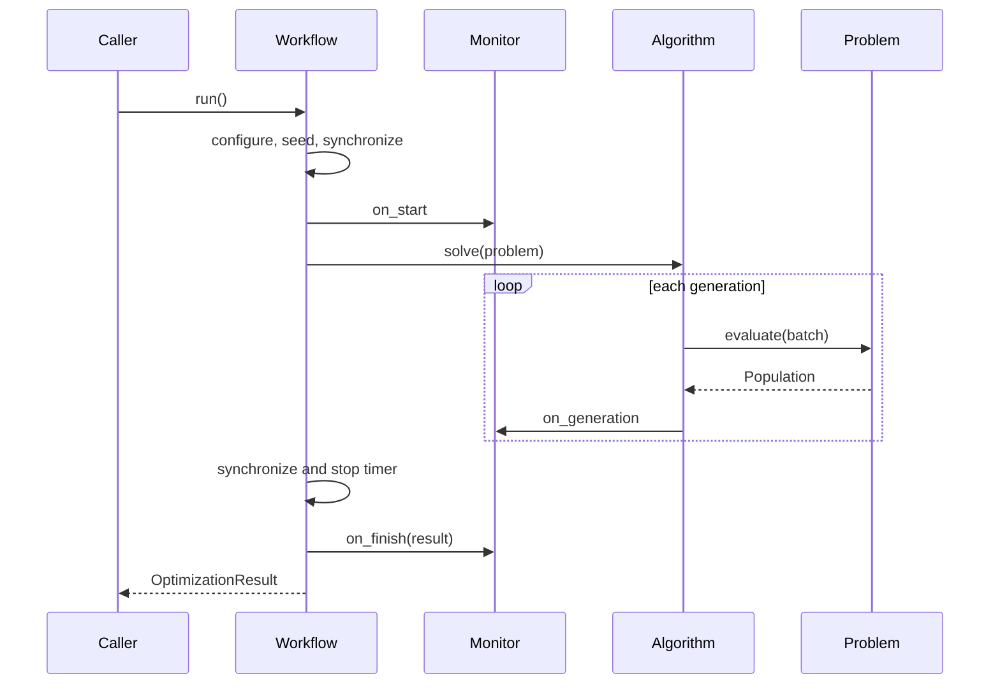

# 核心对象与执行流

## Population：批量数据契约

`Population` 把一个种群的决策、目标和约束绑定在一起。所有字段第一维必须
表示个体，索引时保持二维批量语义，因此选取单个索引仍可安全传给种群算子。

常用操作：

```python
subset = population[index]
copy = population.clone()
cpu_copy = population.detach().to("cpu")
size = len(population)
```

算法实现不应把目标值转换成 Python 列表后再排序，这会导致设备同步、数据搬运和语义
分叉。需要标量控制条件时，才在代际边界调用 `.item()`。

## Problem：评价与边界的所有者

问题基类负责：

- `N`、`M`、`D` 和 `max_fe`；
- 决策变量上下界与编码；
- `initialization()` 批量初始化；
- `evaluation()` / `evaluate()` 批量计算；
- `cal_obj()`、`cal_con()` 和可选 `cal_dec()`；
- 参考目标集属性 `optimum` 与绘图表示属性 `pf`；
- 已完成评价次数 `FE`。

调用顺序为：输入决策张量先经过通用边界和编码修复，再经过可选 `cal_dec` 批量修复，
然后计算目标与约束，构造 `Population` 并增加 `FE`。用户问题只需覆盖与自身语义相关的
方法。

## Algorithm：代际状态机

算法子类实现 `_solve(problem, output, should_stop, should_pause)`。典型结构如下：

```python
class MyAlgorithm(Algorithm):
    def _solve(self, problem, output, should_stop, should_pause):
        population = problem.initialization()
        while self.not_terminated(
            problem, population, output, should_stop, should_pause
        ):
            offspring = ...
            population = ...
```

`not_terminated` 在每代边界记录种群、更新公开的 `final_population`、触发回调并判断
评价预算。保留一个代际 `while` 是有意的；代内个体操作应由批量张量算子完成。

## Workflow：运行期编排

`Workflow.run` 依次执行：

1. 解析 `cpu` 或 `npu:k` 设备；
2. 配置 PyTorch 和 CPU 线程；
3. 固定 Python、NumPy、PyTorch 与 NPU 随机状态；
4. 把问题边界及缓存迁移到目标设备；
5. 调用监控器 `on_start`；
6. 同步设备并开始计时；
7. 执行算法，每代调用监控器；
8. 再次同步设备并结束计时；
9. 构造 `OptimizationResult`，调用 `on_finish`。

异常会按原样抛出，并在抛出前调用 `Monitor.on_error`。



## Monitor：旁路观察

监控器不应改变算法结果。`HistoryMonitor(copy_to_cpu=True)` 会克隆每代完整种群并迁移
到 CPU，适合小规模调试和完整历史保存；大规模实验若长期保存在进程内会快速消耗内存，
应实现流式监控器，在每代用临时文件加原子重命名落盘。

```python
class JsonMonitor(Monitor):
    def on_generation(self, algorithm, problem):
        pop = algorithm.final_population.detach().to("cpu")
        # Write a generation record through an atomic storage helper.
```

## 注册表与直接导入

内置类既可直接导入，也可通过注册名创建：

```python
from ascendmoea.algorithms import NSGAII
from ascendmoea.problems import DTLZ2

from ascendmoea import create_algorithm, create_problem
assert isinstance(create_algorithm("NSGAII"), NSGAII)
assert isinstance(create_problem("DTLZ2"), DTLZ2)
```

`ComponentRegistry` 提供可变映射接口、唯一名称检查、装饰器注册和实例构造。注册冲突会
立即报错，避免配置驱动实验悄然调用错误组件。

## 状态与设备约束

- 同一个算法或问题实例不要并发用于多个实验进程。
- 运行完成后如果要复用问题，先重新构造实例以清零 `FE` 和设备缓存。
- 不要在算法内部频繁执行 `.cpu()`、`.numpy()` 或创建默认 CPU 张量。
- 新张量应从现有张量派生，或显式使用 `dtype=problem.dtype, device=problem.device`。
- 设备不匹配应直接报错，不应通过隐式复制掩盖。
