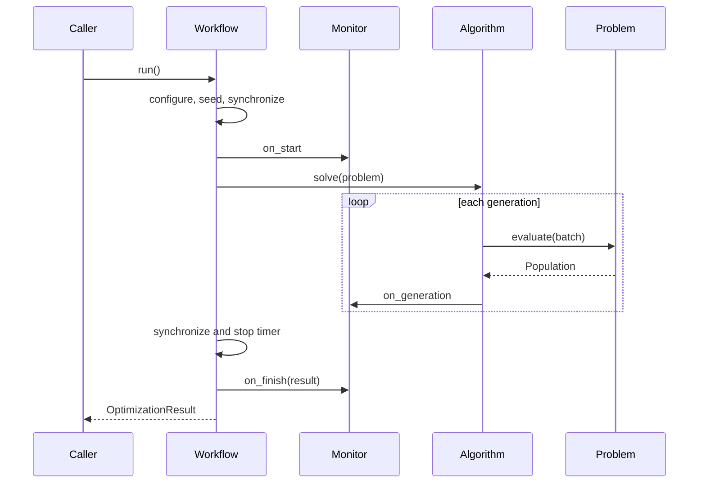

# Core Objects and Execution Flow

## Population: Batched Data Contract

`Population` binds decision variables, objectives, and constraint violations into a unified container. The leading dimension of each attribute tensor represents individual solutions. Slicing preserves 2D batch semantics, ensuring that extracted subsets can be passed directly to evolutionary operators.

Common operations:

```python
subset = population[index]
copy = population.clone()
cpu_copy = population.detach().to("cpu")
size = len(population)

```

Algorithm implementations must not convert objective values into standard Python lists for sorting, as this introduces device synchronizations, CPU-device transfers, and semantic overheads. Restrict `.item()` calls strictly to generation-level control checks.

## Problem: Evaluations and Boundary Definition

The `Problem` base class manages:

* Problem dimensions: `N`, `M`, `D`, and `max_fe`
* Decision variable bounds and encodings
* Batched initialization via `initialization()`
* Batched evaluations via `evaluation()` / `evaluate()`
* Computation methods `cal_obj()`, `cal_con()`, and optional `cal_dec()`
* Reference Pareto front (`optimum`) and visualization attributes (`pf`)
* Consumed function evaluation counter (`FE`)

Evaluation order: raw decision tensors undergo boundary and encoding repairs, followed by optional problem-specific repairs via `cal_dec`. Objectives and constraints are evaluated, wrapping the data into a `Population` and incrementing `FE`. Custom problems only need to override methods matching their specific formulation.

## Algorithm: Generational State Machine

Algorithm subclasses implement `_solve(problem, output, should_stop, should_pause)`. Typical structure:

```python
class MyAlgorithm(Algorithm):
    def _solve(self, problem, output, should_stop, should_pause):
        population = problem.initialization()
        while self.not_terminated(
            problem, population, output, should_stop, should_pause
        ):
            offspring = ...
            population = ...

```

At each generation boundary, `not_terminated` records current population states, updates `final_population`, triggers callbacks, and checks evaluation limits. The outer generational `while` loop remains intentional; all internal operations on individuals must use vectorized tensor operators.

## Workflow: Runtime Orchestration

`Workflow.run` executes the following sequence:

1. Resolve device target (`cpu` or `npu:k`).
2. Configure PyTorch runtime and CPU intra-op threads.
3. Seed Python, NumPy, PyTorch, and NPU random number generators.
4. Transfer problem bounds and cached tensors to the target device.
5. Trigger monitor `on_start`.
6. Synchronize device and start the timer.
7. Execute algorithm generational loop, invoking monitors per generation.
8. Synchronize device and stop the timer.
9. Construct `OptimizationResult` and invoke `on_finish`.

Runtime exceptions are propagated after invoking `Monitor.on_error`.



## Monitor: Non-intrusive Instrumentation

Monitors must not alter optimization states. `HistoryMonitor(copy_to_cpu=True)` clones and transfers full generational populations to the CPU, suitable for debugging and post-run analysis. For large-scale benchmarks, keeping complete population histories in memory will exhaust RAM; implement streaming monitors that write checkpoints to disk using atomic rename operations.

```python
class JsonMonitor(Monitor):
    def on_generation(self, algorithm, problem):
        pop = algorithm.final_population.detach().to("cpu")
        # Write a generation record through an atomic storage helper.

```

## Registries and Direct Imports

Built-in components can be imported directly or instantiated via string registry identifiers:

```python
from ascendmoea.algorithms import NSGAII
from ascendmoea.problems import DTLZ2

from ascendmoea import create_algorithm, create_problem
assert isinstance(create_algorithm("NSGAII"), NSGAII)
assert isinstance(create_problem("DTLZ2"), DTLZ2)

```

`ComponentRegistry` provides mutable mapping access, unique identifier validation, decorator-based registration, and dynamic instantiation. Identifier collisions raise immediate errors to prevent configuration-driven experiments from dispatching incorrect components.

## State and Device Constraints

* Do not share algorithm or problem instances across concurrent worker processes.
* Re-instantiate problem objects between runs to clear evaluation counts (`FE`) and cached state.
* Avoid recurring calls to `.cpu()`, `.numpy()`, or default CPU tensor initializations inside inner algorithm loops.
* Derive new tensors from existing population tensors or initialize them explicitly using `dtype=problem.dtype, device=problem.device`.
* Device mismatches must raise errors immediately rather than falling back to implicit transfers.
